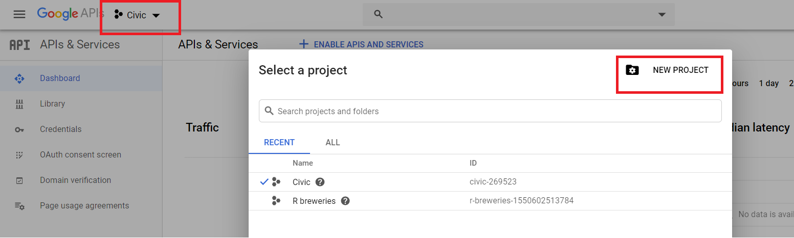
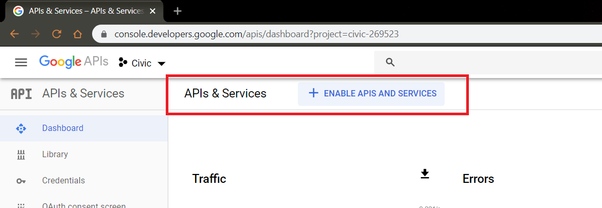
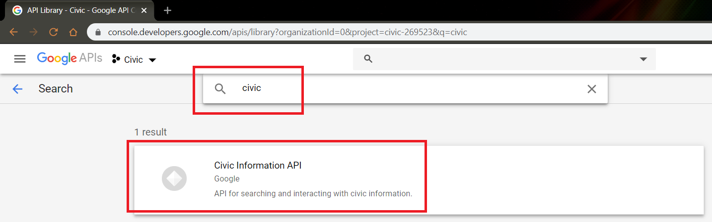
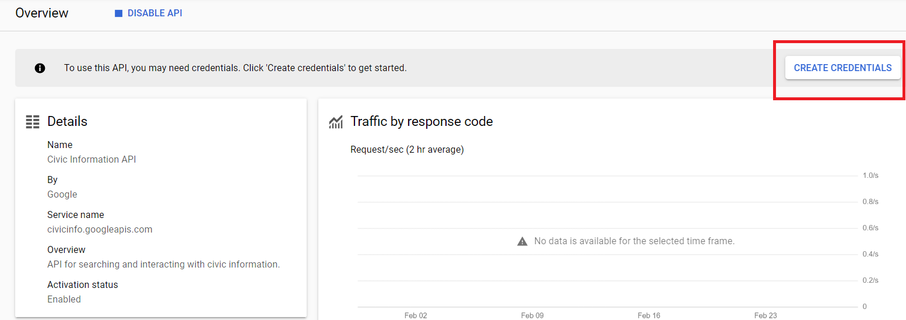

```{r setup, include = FALSE}
knitr::opts_chunk$set(
  collapse = TRUE,
  comment = "#>",
  fig.path = "man/figures/README-",
  out.width = "100%"
)

library(knitr)
```
# {googlecivic}

{googlecivic} is an R package designed to interface with the Google Civic Information API. In order to use this R package you will need to have a project under a Google Cloud Platform account and will need to create an API key for that project. Log in or create an account for [Google Cloud Platform](https://console.developers.google.com/apis). Click on the dropdown in the console in the top left, then create a new project:

```{r project, echo = FALSE}



```

Next, enable APIs and services on the project:

```{r enable, echo = FALSE}



```

Then, search for the google civic API and enable it:

```{r search, echo = FALSE}


knitr::include_graphics("./images/add.png")

```

Create a key for the Google Civic API:


```{r cred, echo = FALSE}



```

Once you have this API key you can save it somewhere safe and supply it to functions in this R package.

The Google Civic API offers several APIs to get information on election information, polling places, and political geographies of representatives. This package current just has a function to interface with the voter information endpoint, but functions will be added in the future to use the full API.

## Installation

You can install the released version of googlecivic from [Github](https://github.com/willdebras/googlecivic) with:

``` {r, echo = TRUE, eval = FALSE}
library(remotes)
install_github("willdebras/googlecivic")
```

## API keys

The functions for each of the three APIs have a `key` argument that defaults to an object called `google_civic_api`. We can use the function argument to manually include the key, such as:

`get_voterinfo(address = "55 e monroe, chicago, il", key = xxxxxxxxxxxxx)`

Alternatively, we can assign the key to an object called `google_civic_api` and leave the `key` argument blank, such as:

`google_civic_api <- xxxxxxxxxxxxx`

The best method to store this key though is probably to set it to an environment variable and call it later, such as:

```{r api, eval = FALSE}

Sys.setenv(google_civic_api="xxxxxxxxxxxxx")

get_voterinfo(address = "55 e monroe, chicago, il", key = Sys.getenv("google_civic_api"))

```

You can also use a `.Renviron` file to have R automatically set the environment variable at startup. The package `usethis` can be handy for this.

```{r, eval=FALSE}
usethis::edit_r_environ()
```

This will open a .Renviron file for you. Add a line like this, but substitute your API key:

`google_civic_api="xxxxxxxxxxxxx"`

Save the file then restart your R session

```{r, eval=FALSE}
get_voterinfo(address = "55 e monroe, chicago, il", key = Sys.getenv("google_civic_api"))
```

## Voter Information API

The voter information API produces a list of voter information related to a single address or election. The function takes a single argument of a string for an address and returns a nested list of information related to elections, polling locations and information, and state information related to elections.

We can get some basic data about voter information with the `get_voterinfo()` function. Type `?get_voterinfo` to see an explanation of each parameter.

```{r example, cache = TRUE}

library(googlecivic)

get_voterinfo(address = "55 e monroe, chicago, il", key = Sys.getenv("google_civic_api"))


```


### API documentation

While the {googlecivic} package has documentation in the help files, it can be useful to see an explanation of each endpoint and each parameter in the functions. The [Google Civic API developer page](https://developers.google.com/civic-information/docs/v2) contains reference to all of these endpoints and parameters and additional documentation of running individual queries outside of the context of this package.

## Future plans

 - Adding support for the other Google Civic API endpoints  
 - Parsing the list of information into a formatted text object
 - Unit tests/CRAN submission :^)
 
## Issues 
 
If you have an issue, feature suggestion, or question regarding use, feel free to open an issue here on github or tweet at me @[_willdebras](https://twitter.com/_willdebras).
